# spring-boot-docker-k8
Basic Spring Boot project having Dockerfile to build image with Jdk22. 
Also, shows how we can deploy that image to kubernetes using minikube locally.

# Prerequisites
Below are the prerequisites to run this application locally

* JDK22
* maven
* Docker Desktop (https://www.docker.com/products/docker-desktop/)
* minikube (https://minikube.sigs.k8s.io/docs/start/?arch=%2Fwindows%2Fx86-64%2Fstable%2F.exe+download)

Follow below steps to execute and run the application locally on Windows.
## Build spring boot package
### 1. Package the application
```bash
mvn clean package
```

### 2. Generated jar file inside target folder:
```bash
spring-boot-docker-k8s-0.0.1.jar
```

## Build docker image and publish to DockerHub
### 1. Let's create a new image using Dockerfile
```bash
docker build . -t gohil90/spring-boot-docker-k8s:v0.0.1
```
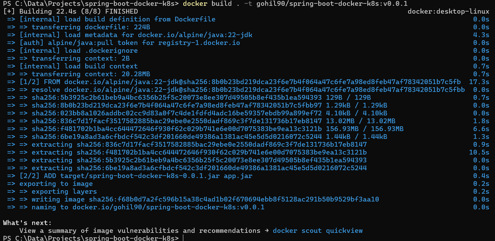

### 2. Login to DockerHub
```bash
docker login
```
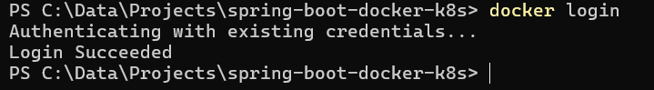

### 3. Push the latest image to DockerHub
```bash
docker push gohil90/spring-boot-docker-k8s:v0.0.1
```

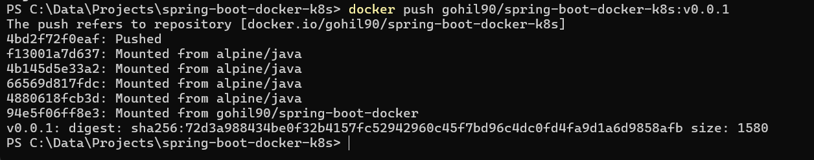

### 4. Verify your image on DockerHub portal
https://hub.docker.com/r/gohil90/spring-boot-docker-k8s

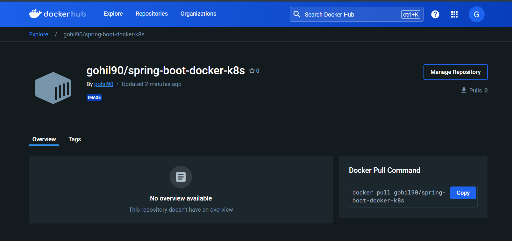

## Deploy on minikube cluster locally
### 1. Start minikube cluster

```bash
minikube start
```

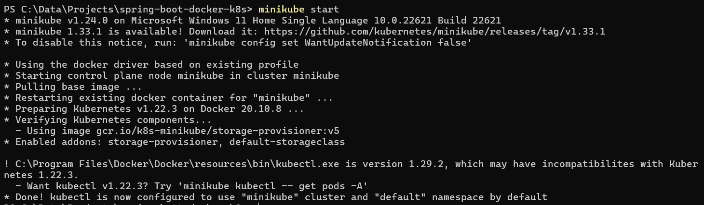

### 2. Check minikube status

```bash
minikube status
```
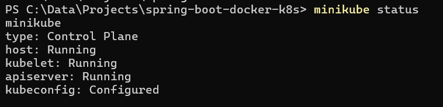

### 3. Create account deployment inside minikube

```bash
kubectl apply -f .\accounts-depl.yaml
```

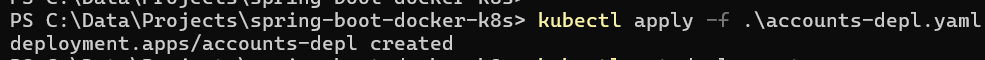

### 4. Check deployment

```bash
kubectl get deployment
```

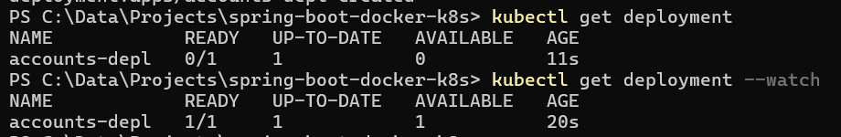

### 5. Check pod

```bash
kubectl get pod
```

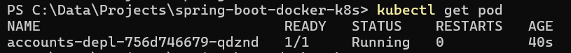

### 6. Create account service inside minikube

```bash
kubectl apply -f .\accounts-service.yaml
```

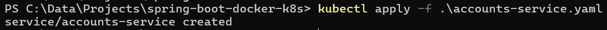

### 7. Check service

```bash
kubectl get service
```

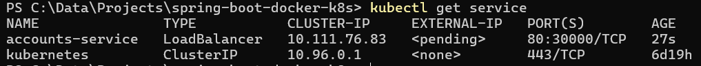


## Run the application locally
### 1. Start services from minikube
```bash
minikube service accounts-service
```

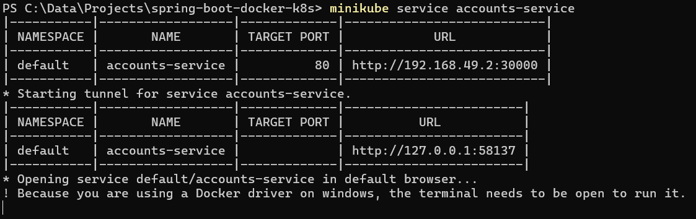

### 2. Hit APIs using external IPs

```bash
http://127.0.0.1:58137/bank/v1/accounts
```
```json
[
  {
    "id": "1",
    "type": "Saving",
    "balance": 82374.234
  },
  {
    "id": "2",
    "type": "Saving",
    "balance": 5615.651
  },
  {
    "id": "3",
    "type": "Current",
    "balance": 6515.0651
  }
]
```